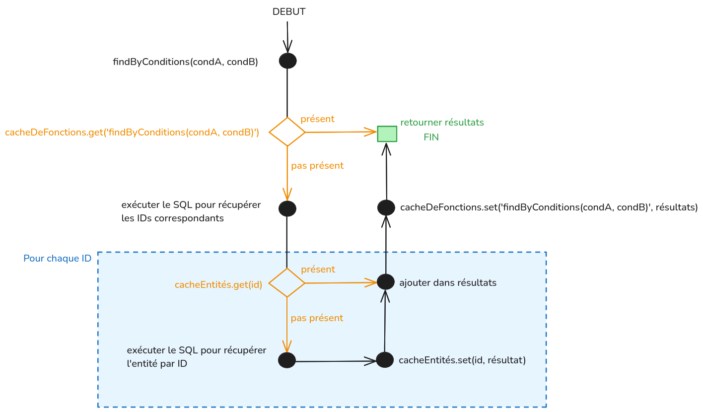

# 58. Modification du fonctionnement du cache de contenu pédagogique
Date : 2024-12-16

## État
Validée

## Historique
Pour ceux qui veulent toute l'histoire, voici le lien vers les précédentes ADR expliquant le fonctionnement du cache de contenu pédagogique aujourd'hui :

- [ADR de la mise en place du cache](0005-ajout-d-un-cache-memoire-distribute-pour-le-contenu-pedagogique.md)
- [ADR traitant du stockage en clé unique dans Redis et en mémoire vive](0016-stockage-du-referentiel-en-cache.md)

## Contexte
Le fonctionnement aujourd'hui consiste à stocker l'entièreté du contenu pédagogique en deux endroits : 

- en mémoire vive
- sur Redis, de sorte que une machine qui vient de lancer un serveur récupère rapidement la donnée

### Limitations et problèmes
#### Crash mémoire
Le contenu pédagogique est un ensemble dont la taille grossit, doucement mais sûrement. Cela fait plusieurs semaines qu'on constate un dépassement mémoire sur les containers 
lorsqu'ils traitent des opérations liées au cache de contenu pédagogique. Ces dépassements correspondent aux moments de lecture et d'écriture, depuis et vers le cache Redis. 
Voici un extrait du fichier `RedisCache.js` :
```js
class RedisCache extends Cache {
  // Lecture depuis le cache Redis
  async get(key, generator) {
    const value = await this._client.get(key);

    if (value) {
      const parsed = JSON.parse(value); // Dépassement mémoire ici
      const patches = await this._client.lrange(`${key}:${PATCHES_KEY}`, 0, -1);
      patches.map((patchJSON) => JSON.parse(patchJSON)).forEach((patch) => applyPatch(parsed, patch));
      return parsed;
    }

    return this._manageValueNotFoundInCache(key, generator);
  }
  // Ecriture vers le cache Redis
  async set(key, object) {
    const objectAsString = JSON.stringify(object); // Dépassement mémoire ici

    logger.info({ key, length: objectAsString.length }, 'Setting Redis key');

    await this._client.set(key, objectAsString);
    await this._client.del(`${key}:${PATCHES_KEY}`);

    return object;
  }
  /* ... */
}
```
Redis stocke des chaînes de caractères, tandis qu'en mémoire vive nous conservons le contenu pédagogique en **_POJO_** (**_plain old javascript object_**). Cette conversion dans 
les deux sens est donc faite dans le code (via `JSON.stringify` et `JSON.parse`), ce qui signifie qu'à un moment donné, dans la pile mémoire de traitement de la fonction, 
on a simultanément le contenu pédagogique en **_POJO_** et en chaînes de caractères. Sachant que, ce jour, le contenu pédagogique fait environ 40 Mo, on peut estimer à, au
minimum, 80 Mo de données, sans parler des allocations diverses et variées nécessaires à l'exécution du code.

#### Peu optimisé
Le contenu pédagogique est stocké dans une seule clé. Cela pose deux défauts majeurs.

D'une part, nous n'avons pas le choix de ce qui mérite d'être promu dans le cache mémoire ou pas. Tout y est.
Pourtant, on sait qu'un certain nombre d'entités sont très peu ou pas consultées dans le fonctionnement des applications Pix, voici une liste non exhaustive :
- Les données sur des entités peu affichées (`frameworks` ou `thematics`)
- Les épreuves non jouables (car périmées ou en atelier)
- Les épreuves dans une langue encore peu jouée sur Pix


D'autre part, et on pense en particulier aux acquis et aux épreuves, il est fréquent de vouloir récupérer toujours le même sous-ensemble. 
Par exemple, tous les utilisateurs qui se positionnent sur la même compétence, dans le code pour récupérer la prochaine épreuve, 
on récupère les mêmes acquis et les mêmes épreuves juste avant de dérouler l'algorithme du choix d'épreuve. Aujourd'hui, on effectue donc les mêmes boucles et les mêmes filtres.

## Solution - Corriger les dépassements en mémoire en remplaçant Redis par PG
Le plus urgent était de réparer le problème des dépassements en mémoire.
Nous l'avons vu, ces dépassements sont directement liés à l'usage de Redis pour stocker le contenu pédagogique.
Nous avons donc décidé de stocker le contenu pédagogique dans la base de données PG. Et plutôt que de stocker la donnée d'un seul tenant,
nous avons créé une table par entité. Ces tables ont été placées dans un schéma dédié `learningcontent`.
Liste des migrations :
- [Toutes les tables](../../api/db/migrations/20241120132349_create-learningcontent-schema-and-tables.js)
- [Retrait de contraintes de clés étrangères](../../api/db/migrations/20241125150331_remove-learningcontent-foreignkeys.js)
- [Correction d'un type de clé primaire](../../api/db/migrations/20241127142253_alter-table-column-id-missions-to-integer.js)

Via l'utilisation de PG, notamment de `knex`, le problème de dépassement de mémoire sera résolu. Les résultats des requêtes effectuées 
auprès de la base sont directement retournés en objets. Aucune transformation n'est nécessaire.

### Écriture
Les écritures dans les tables se produisent à trois occasions distinctes :
- Lors d'un rafraîchissement du cache (planifié par cron ou ponctuel via PixAdmin), durant lequel on récupère la dernière release
- Lors d'une création forcée de nouvelle release (via PixAdmin), durant laquelle on va demander à l'API LCMS de créer une nouvelle release et de nous la retourner
- Lors d'un patch d'une entité (opération effectuée seulement sur l'environnement de recette)

Les `repositories` en charge des écritures sont appelés à ces trois occasions dans une transaction.
Ils procèdent à des `upserts`, c'est-à-dire à des insertions ou des modifications, mais pas de suppression.
Ces nouveaux `repositories` d'écriture ont été placés dans le dossier `src/learning-content`.

Les opérations d'écriture sont prises en charge par un seul process (selon les cas, le worker qui dépile les jobs PGBoss ou un one-off).
Ce process est donc aussi responsable de signaler auprès de tous les containers en fonctionnement que le contenu pédagogique a changé afin qu'ils
réinitialisent leur cache en mémoire vive. Ce système est assuré par un pubsub via Redis.

### Lecture
La mise en cache en mémoire vive d'éléments du contenu pédagogique est possible pour deux raisons principales :
- Le contenu pédagogique est en lecture seule côté API Pix, qui est consommateur de la donnée
- Ce contenu pédagogique ne change que très peu souvent, de façon nominale qu'une seule fois par jour

Nous avons pleinement bénéficié du découplage procuré par la clean archi ! Nous n'avons rien modifié aux interfaces des `repositories` de contenu pédagogique.
En revanche, nous avons changé l'implémentation afin de mettre en place un système de cache en mémoire vive en deux couches.
Chaque `repository` gère son propre cache en double couches.

La **première couche**, appelée **_cache de fonctions_**, est un cache usant de mémoïsation. Il est très fréquent de requêter les mêmes sous-ensembles de données, voici deux exemples :
- Quand on s'évalue en positionnement autonome sur une compétence, on demande toujours les épreuves actives de la compétence
- Quand on s'évalue sur une campagne, on demande toujours l'ensemble des épreuves jouables correspondants aux acquis de la campagne

Nous allons mettre en cache les résultats d'un appel de méthode d'un `repository` dans un cache clé/valeur, où la clé unique est composée à
partir du nom de la méthode et des paramètres, et la valeur est le résultat attendu.
Exemples de clés dans le `challenge-repository`:
```js
findValidatedByCompetenceId(competenceABC123, fr)
findActiveFlashCompatible({ locale: fr, accessibilityAdjustmentNeeded: false })
```
Ainsi dès le deuxième appel à une même méthode avec les mêmes arguments, les données sont immédiatement retournées.
Cette seule couche de cache ne suffit pas car, en l'état, elle consommerait beaucoup de mémoire. Considérons une épreuve `abc`, si cette épreuve fait
partie du résultat de plusieurs appels de fonctions différents avec des arguments différents, elle serait alors stockée plusieurs fois en mémoire.

La **deuxième couche**, appelée **_cache d'entités_** est un cache associant une clé, un ID d'entité du contenu pédagogique, à une valeur qui est un `POJO` avec la donnée correspondante.
L'idée est que la donnée de chaque entité est stockée dans le **_cache d'entités_**, et le **_cache de fonctions_** contient des références vers ces entités.
En mémoire nous aurions donc en un seul exemplaire les entités du contenu pédagogique, ainsi que des collections de références vers ces entités.
Aussi, le fonctionnement de récupération des données est _lazy_ : les entités remontées en mémoire ne sont que celles qui ont été demandées. Ce faisant,
les entités qui ne sont jamais demandées ne sont jamais mises en mémoire, contrairement au système précédent. Nous pensons par exemple aux épreuves non jouables
ou encore aux épreuves traduites dans des langues encore très peu jouées.

Voici un schéma explicatif de la mise en cache. C'est un schéma _simplifié_, en réalité l'implémentation du **_cache d'entités_** est techniquement plus évoluée et plus
optimisée (batching de requêtes simultanées, déduplication et autres via l'usage de la brique [Dataloader](https://github.com/graphql/dataloader)) :


