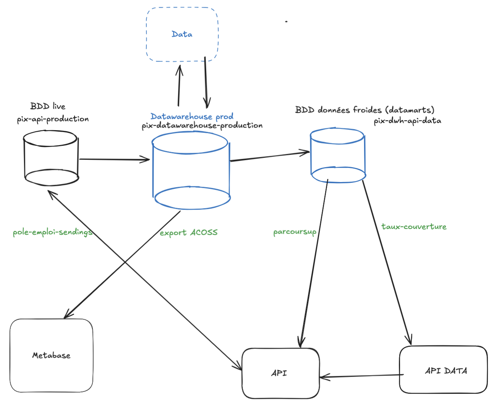
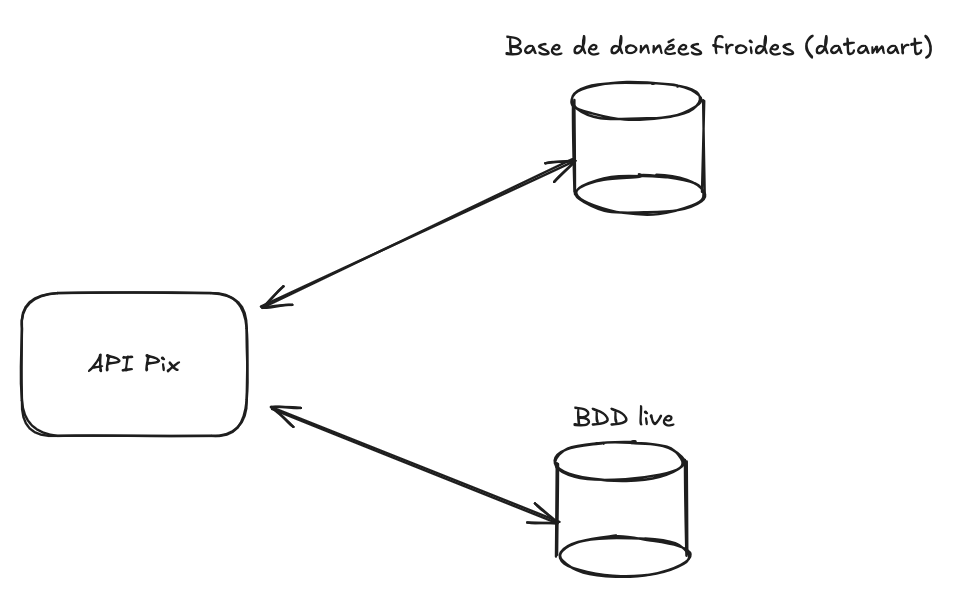
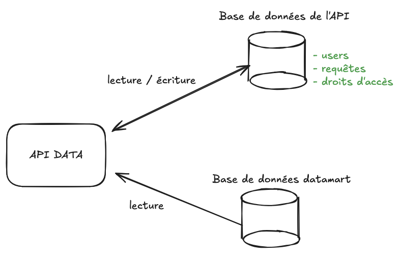
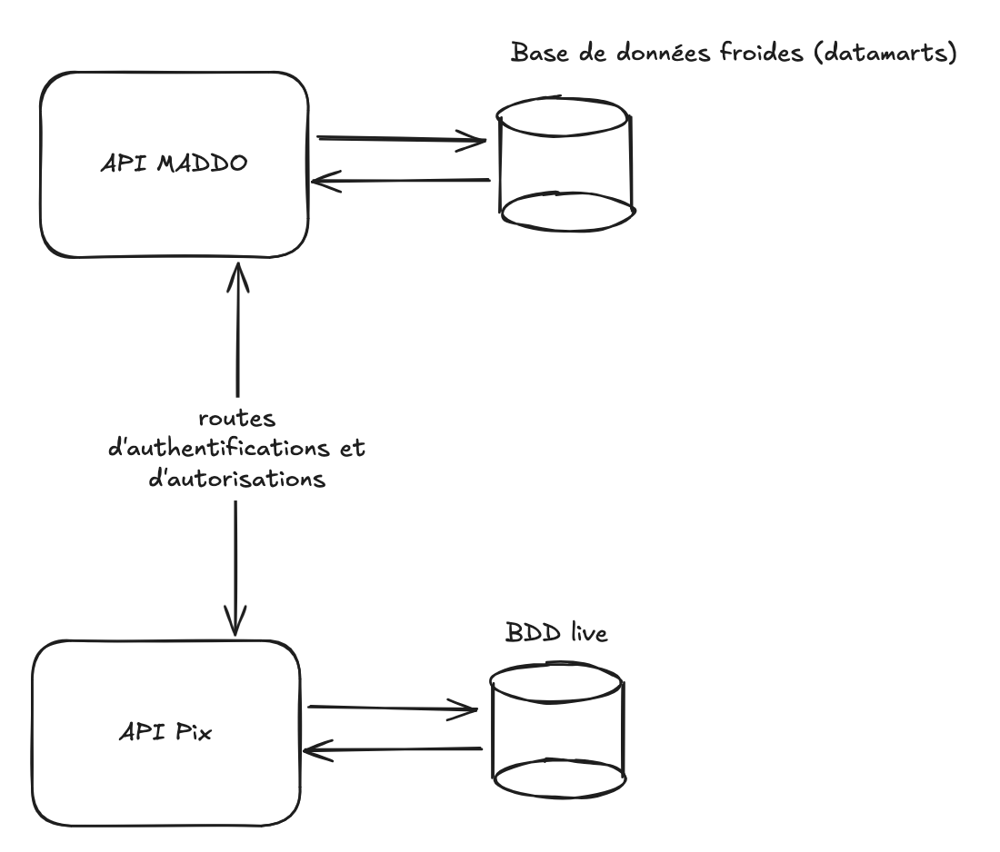
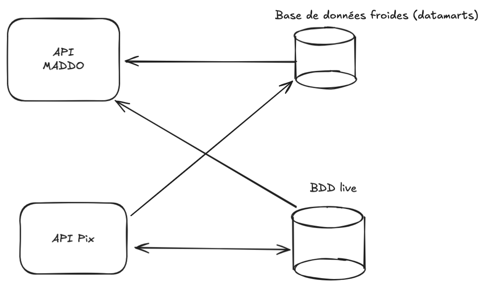

# 59. Mise à disposition de données

Date : 2025-02-11

## État

Validée

## Contexte

Plusieurs partenaires récupèrent des données Pix pour les intégrer à leur SI.
Ces données sont obtenues par différents moyens :

* Export depuis Metabase, ou généré par Data, déposé sur le cloud Pix
* Appel de routes de l'API Pix qui exploite des données de la base live
* Appel de routes de l'API Pix qui exploite des données de la base froide

Pour répondre à cette problématique de mise à disposition des données, un tech days en 2023 a permis de mettre en œuvre
une brique [API Data](https://github.com/1024pix/pix-api-data).
Cette brique est basée sur l'envoi de requêtes stockées à une base de données froides.

Cependant, une première utilisation, pour la page analyse qui utilise le taux de couverture dans Pix Orga, a mis en
évidence plusieurs problèmes :

* absence de documentation du contrat de l'API : point d'entrée générique, qui ne permet pas de documenter facilement
  les données mises à disposition.
* gestion d'autorisation inadaptée : droit sur une requête et droit pour chaque valeur de paramètre de
  la requête
* absence de logique métier
* difficulté à tester, car le schéma et les requêtes ne sont pas connus

En 2025, de nombreuses interconnexions ont été prévues avec divers partenaires ce qui fait émerger de nouveaux
sujets :

* facturation de ces interconnexions
* offre d'un service standardisé (documenté, testable, industrialisé)
* limitation de l'impact sur la production de Pix (performances)

Ces nouveaux sujets motivent la mise au point d'une solution standardisée pour mettre à disposition ce type de données.

## Solutions envisagées

Dans toutes les pistes envisagées qui suivent, nous ne modifions en aucun cas le fonctionnement de la réplication avec le Datawarehouse.

### Solution 1 : Conserver l'architecture actuelle, sans l'API Data

Déplacement des données froides dans une base dédiée en utilisant l'API de Pix pour les mettre à disposition.

#### Avantages

* Pas d'augmentation de la volumétrie de la BDD de production avec des données froides
* L'architecture reste inchangée
* Expérience de développement inchangée
* Utilisation des contextes et objets métier
* Gestion de l'authentification et des autorisations déjà en place
* Infrastructure réseau présente : Baleen, monitoring, etc.

#### Inconvénients

- Le traffic lié à la mise à disposition de données impact la charge de l'API, alors que l'usage est spécifique et nécessite des données froides. 
- La disparité de temps de réponse des requêtes provoque des files d’attente de requêtes et une baisse de performance globale (erreurs 504).
  - d’un côté des appels du front qui utilisent le cache et sont rapides
  - de l’autre des appels de mise à disposition de données qui chargent des données froides en base et sont plus lents

### Solution 2 : Reprendre l’API Data

L'API Data actuelle se base sur des requêtes stockées dans une base qui sont jouées sur une base de données froide.
Ces requêtes sont ajoutées en faisant une insertion dans une table.

#### Avantages

- L'équipe Data est autonome pour ajouter de nouvelles requêtes, de nouveaux utilisateurs et certaines permissions.

#### Inconvénients

- La gestion des authentifications et autorisations est très sommaire et différente de ce qui se fait sur l'API.
  Cela implique des audits de sécurité différents, et peut potentiellement provoquer des failles de sécurité.
  De plus, nous ne souhaitons pas forcément avoir deux bases d'utilisateurs distinctes.
- Comme les requêtes et le schéma ne sont pas connus, les tests de non-régressions sont compliqués à mettre en place.
- La mise à disposition d'une documentation des requêtes demanderait un développement spécifique à chaque requête, contrairement au déclaratif mis en place via Joi. 

### Solution 3 : Création d'une API de mise à disposition de données (base de code indépendante)

Création d'une nouvelle API (MaDDo) contenant uniquement les routes de mise à disposition de données. L'authentification
et les autorisations sont alors déléguées à l'API Pix.
Cette API a pour base de données unique une base de données froides.

#### Avantages

* Routes de MaDDo et de l’API isolées
* Base de code limitée aux nouveaux besoins
* Scaling des conteneurs de cette API adapté au besoin

#### Inconvénients

* La gestion déléguée de l'authentification et des autorisations :
  * Crée une dépendance entre MaDDo et l'API Pix, qui amène une complexité non nécessaire qui perdure durant la
    maintenance du projet
  * Augmente le risque de sécurité du fait de l'absence d'utilisation d'un standard
* Pas de partage de code métier avec l'API Pix (en l’absence de mise en place de bibliothèque partagée) :
  * ce qui oblige potentiellement à maintenir deux fois les mêmes modèles et règles métiers. Cela peut provoquer des
    désynchronisations.
  * ce qui rend le contract testing obligatoire pour assurer la non-régression.

### Solution 4 : Création d'une API de mise à disposition de données (base de code mutualisée)

Création d'une variante de l'API Pix, exposant uniquement les routes de mise à disposition de données.
L'authentification et les autorisations sont donc gérées par le même code que pour l'API Pix.

Cette API utilise deux bases de données :

* une base de données froides en base principale
* la base de données de Pix, notamment pour l'authentification et les autorisations

#### Avantages

* Expérience de développement inchangée
* Code support (logging, healthcheck, etc.) et métier (modèles, règles, etc.) de l'API mutualisé
* Routes de MaDDo et de l’API isolées
* Scaling des conteneurs de cette API adapté au besoin

#### Inconvénients

* Les Review Apps doivent se partager leurs URL de connexion à la base de données : l'API met à jour l'API MaDDo pour
  lui donner la base de données live, et inversement pour la base de données froides.
* Les Review Apps sont plus lourdes, car il y a une application supplémentaire à déployer.
* Pour que Maddo puisse démarrer, il lui faut attendre le déploiement de l'API, afin que les migrations sur la base de
  données Pix aient été faites.

## Décision

La solution n°4 nous semble être le meilleur compromis pour permettre à une feature team de mettre à disposition de
manière autonome de nouvelles données.

Les points qui ont le plus motivé cette décision sont les suivants :

* sécurité au niveau de celle de l'API Pix
* expérience de développement favorisant l'autonomie des équipes
* séparation des usages qui a pour conséquence la sécurisation des usages à destination des applications (front)
* documentation des endpoints et données mis à disposition

## Conséquences

* Création d'une nouvelle infrastructure pour l’API MaDDo basée sur le code de l'API Pix
* Les futurs travaux de mise à disposition des données sont à la charge des équipes de développement
