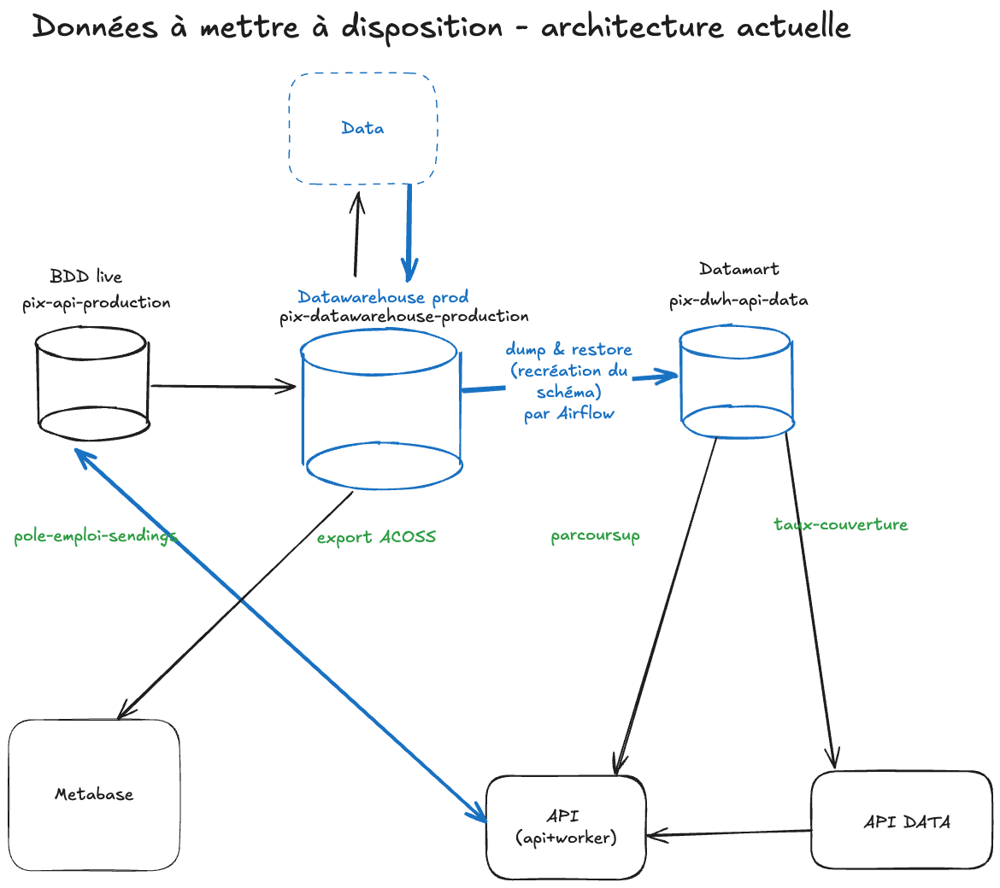
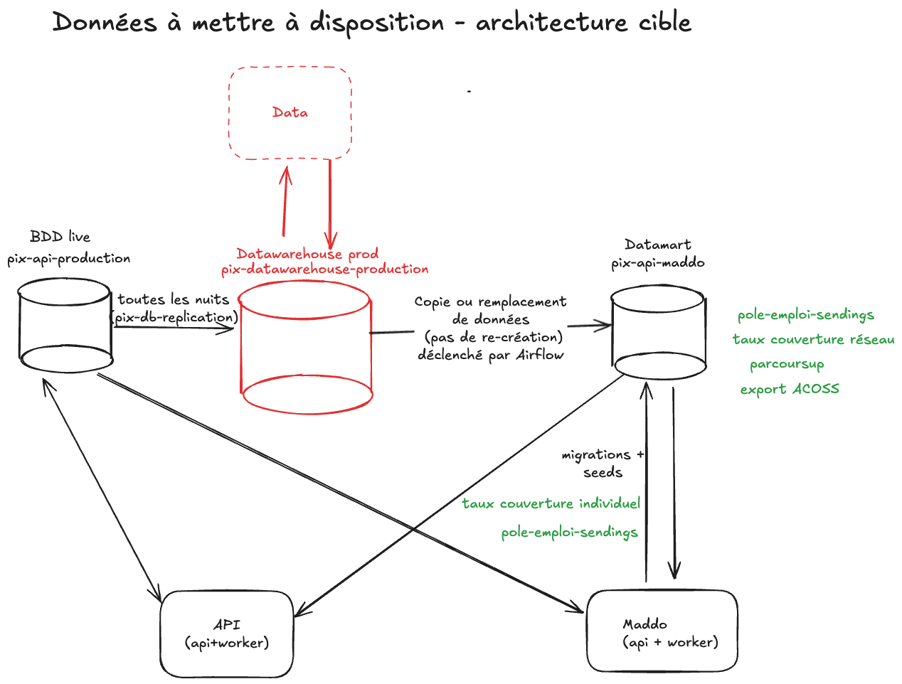

# 60. Production de données à mettre à disposition

Date : 2025-02-18

## État

Validée

## Contexte

Le stockage de données à mettre à disposition est fragmenté dans deux bases de données, la base de données "live" de
`pix-api` et la base de données de `pix-dwh-api-data` (aussi appelée "datamart").
La production de ces données est réalisée par divers mécanismes comme le montre le schéma suivant (flèches en bleu).

On peut constater que :

- les données `pole-emploi-sendings` sont produites par `pix-api` et stockées dans la base de données "live"
- les données `parcoursup` sont produites par l'équipe Data et stockées dans le datawarehouse
- le datawarehouse est répliqué via dump/restore par Airflow, notre orchestrateur, dans la base de
  données `pix-dwh-api-data`.

Le schéma du datamart n'est pas maitrisé par`pix-api` et peut être changé sans possibilité de rétro-compatibilité.
Il est alors complexe de maintenir des tests de non-régression sur ces données.

La réplication via un process de dump/restore présente plusieurs inconvénients tels que:

- absence de données en cas de dysfonctionnement du restore
- copies volumineuses (car complètes) coûteuses en temps et en ressources
- pas de garantie de l'intégrité du schéma car le restore recrée une table de zéro.

Les données, qui ont pour unique vocation la mise à disposition, sont stockées dans la base de données "live" et
augmentent inutilement la pression sur celle-ci (en termes de volume et de trafic).

## Solution

L'introduction de la nouvelle brique d'API de "Mise A Disposition de Données" implique d'avoir la maitrise du schéma du
datamart pour assurer la continuité de service.
Ainsi, le schéma est préservé et les modifications de celui-ci sont entièrement à la main de l'API MADDO.
Des tests de non-régression seront donc plus faciles à maintenir.
Il sera également possible d'assurer une rétro-compatibilité en cas de changement du schéma.

D'autre part, on propose de déplacer le stockage de toutes les données à mettre à disposition vers la base de données
adhoc (ie. le datamart).

Le schéma qui suit montre l'architecture cible.

Remarque : Metabase n'est plus utilisé dans le cadre de la mise à disposition de données dans l'architecture cible.

## Conséquences

- Airflow n'est plus responsable de dump/restore les données vers le datamart, mais déclenche seulement l'appel à l'API
  MADDO pour lancer les jobs réplications.
- Des workers spécifiques à Maddo sont mis en place et auront la charge de créer et répliquer les données destinées à la
  mise à disposition.
